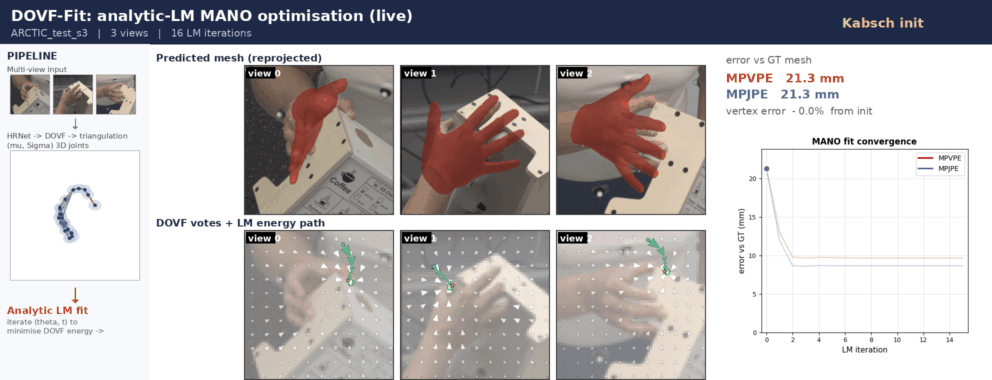

# parafit

**A pluggable analytical solver for parametric model fitting.**

`parafit` fits parametric models -- hands (MANO, UmeTrack), bodies (SMPL-X), and
6-DoF objects -- to multi-view evidence with a batched, differentiable
Levenberg-Marquardt solver. Its **energies**, **models**, and **execution
backend** are all pluggable. It is the reusable solver core behind
[UA-Fit](https://marcilzakour.github.io/ua-fit/) (ECCV 2026 HANDS Workshop), released
standalone so new projects depend on one implementation instead of re-porting the same math.

<p align="center">
  
  <br>
  <em>The LM solver fitting a MANO hand to multi-view evidence, with the energy trajectory live.</em>
</p>

## Why

Three ideas, cleanly separated:

- **Models** (`parafit.models`) -- a parametric model owns its parameter layout,
  a differentiable forward (FK+LBS -> landmarks/verts), and an optional
  *analytic* Jacobian (autograd fallback otherwise).
- **Energies** (`parafit.energies`) -- each residual term contributes a
  Gauss-Newton block `(A, g, cost)`. Compose them explicitly; no global state.
- **Solver** (`parafit.LMSolver`) -- adaptive LM with per-sample accept/reject,
  swappable backend (torch now; CUDA / TensorRT planned via the fixed-iteration
  exportable path).

## Install

Core is torch-only; install from GitHub (PyPI release planned):

```bash
pip install "git+https://github.com/marcilzakour/parafit.git"                # core solver + reprojection/anchor/pose-prior energies
pip install "parafit[mano] @ git+https://github.com/marcilzakour/parafit.git"  # + MANO hand model
pip install "parafit[all] @ git+https://github.com/marcilzakour/parafit.git"   # everything
```

Or for development:

```bash
git clone https://github.com/marcilzakour/parafit.git
cd parafit && pip install -e ".[mano]"
```

With **uv** (recommended; resolves the git-only manotorch dep):

```bash
uv pip install "parafit[mano] @ git+https://github.com/marcilzakour/parafit.git"
```

Install torch for your CUDA build first. MANO weights are not shipped (license):
point the loader at your local `mano_v1_2` assets.

## Quick start (core, no MANO needed)

```python
import torch
from parafit import LMSolver, ReprojectionEnergy, PinholeCameras
from parafit.models.example import RigidKeypointModel

model = RigidKeypointModel(canonical_points)          # (J,3)
cams = PinholeCameras(K, w2c)                          # (B,V,3,3), (B,V,4,4)
energy = ReprojectionEnergy(cams, target_uv)          # (B,V,J,2)
result = LMSolver(max_iters=15).solve(model, init_params, [energy])
print(result.params, result.diagnostics["final_cost"])
```

Run the end-to-end test (multi-view rigid fit + finite-difference Jacobian check):

```bash
python tests/test_core_overfit.py
```

## Status

v0.1.0 -- core solver (tensordict-batchable) + reprojection / 3D-anchor /
pose-prior energies and the `ManoModel` (analytic-Jacobian MANO hand) are
implemented and tested. `UmeTrackModel` and `ContactSDFEnergy` are interface
stubs slated for the next release.
Roadmap: UmeTrack port -> multi-body scene (hand+object) -> CUDA/TensorRT
backend. See `docs/parafit-library-design.md`.

## License

MIT.
